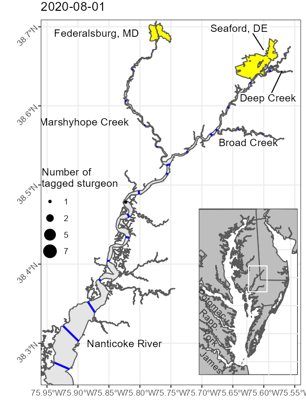

<!-- README.md is generated from README.Rmd. Please edit that file -->

```{r, include = FALSE}
knitr::opts_chunk$set(
  collapse = TRUE,
  comment = "#>"
)
```

# Marshyhope Creek Atlantic Sturgeon
## 2019 - 2022

Code and analysis for UMCES portion of *Spawning movement behaviors, habitat dependencies and run size of Nanticoke River
Atlantic sturgeon*, funded through the 2019 NOAA Species Recovery Grants to States Program.

Questions regarding the data, code, and other files associated with the project should be directed to Dave Secor: secor@umces.edu.

